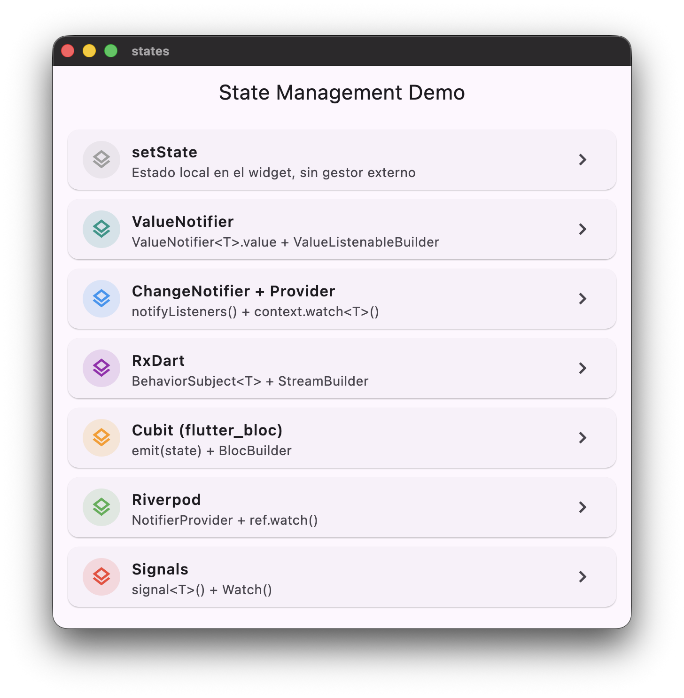

# Flutter State Management Playground

🌐 **[Live demo](https://gonbitz.github.io/states/)**



A hands-on comparison of **7 state management approaches** in Flutter, all solving the same Todo app problem. Each approach lives in its own isolated page so you can open the code side-by-side and compare how each one handles state changes, rebuilds, and lifecycle.

## Approaches covered

| # | Approach | Key mechanism | Rebuild trigger |
|---|---|---|---|
| 1 | `setState` | Local widget state | `setState(() {})` |
| 2 | `ValueNotifier` | Single observable value | `.value =` |
| 3 | `ChangeNotifier` + Provider | Mutable notifier injected via Provider | `notifyListeners()` |
| 4 | RxDart | `BehaviorSubject` stream | `.add(newState)` |
| 5 | Cubit (flutter_bloc) | Immutable state machine | `emit(newState)` |
| 6 | Riverpod | `NotifierProvider` outside the widget tree | `state =` |
| 7 | Signals | Reactive fine-grained primitives | `signal.value =` |

## What each approach teaches

- **setState** — baseline; shows why you quickly need something beyond local widget state.
- **ValueNotifier** — simplest observable; one step above setState, no external packages.
- **ChangeNotifier + Provider** — mutable internal state with explicit notifications; the most common pattern in mid-size apps.
- **RxDart** — stream-based reactivity; useful when you already work with async data pipelines.
- **Cubit** — enforces immutable state and a single emit point; great traceability via `BlocObserver`.
- **Riverpod** — state lives outside the widget tree; no `BuildContext` needed to read or write.
- **Signals** — fine-grained reactivity inspired by SolidJS; only the `Watch` that accessed a signal rebuilds.

## Project structure

Feature-first layout: each state management approach owns its page and its controller in the same folder.

```
lib/
├── core/
│   ├── models/
│   │   └── todo.dart                       # Shared Todo model (Equatable)
│   └── widgets/
│       └── todo_widgets.dart               # Shared UI components
├── features/
│   ├── set_state/
│   │   └── set_state_page.dart
│   ├── value_notifier/
│   │   ├── todo_value_notifier.dart
│   │   └── value_notifier_page.dart
│   ├── change_notifier/
│   │   ├── todo_change_notifier.dart
│   │   └── change_notifier_page.dart
│   ├── rxdart/
│   │   ├── todo_rx_controller.dart
│   │   └── rxdart_page.dart
│   ├── cubit/
│   │   ├── todo_state.dart                 # Immutable state (Equatable)
│   │   ├── todo_cubit.dart
│   │   ├── simple_bloc_observer.dart       # Logs every emit to console
│   │   └── cubit_page.dart
│   ├── riverpod/
│   │   ├── todo_notifier.dart
│   │   └── riverpod_page.dart
│   └── signals/
│       ├── todo_signals_controller.dart
│       └── signals_page.dart
├── home/
│   └── home_page.dart                      # Entry point — list of all approaches
└── main.dart
```

## Notable implementation details

- **`TodoState` and `Todo` extend `Equatable`** — prevents unnecessary rebuilds when state is equal by value.
- **`SimpleBlocObserver`** — wire it in `main.dart` to trace every Cubit state change in the console during development.
- **`ProviderScope`** wraps the entire app at the root, required by Riverpod.
- All pages share the same `TodoList`, `TodoInputBar`, and `TodoInfoChip` widgets — only the state wiring differs.
- Code is linted with [`very_good_analysis`](https://pub.dev/packages/very_good_analysis).

## Getting started

```bash
flutter pub get
flutter run
```

## Dependencies

```yaml
flutter_bloc: ^9.0.0
flutter_riverpod: ^3.3.1
provider: ^6.1.2
rxdart: ^0.28.0
signals_flutter: ^6.3.0
equatable: ^2.0.5
```
